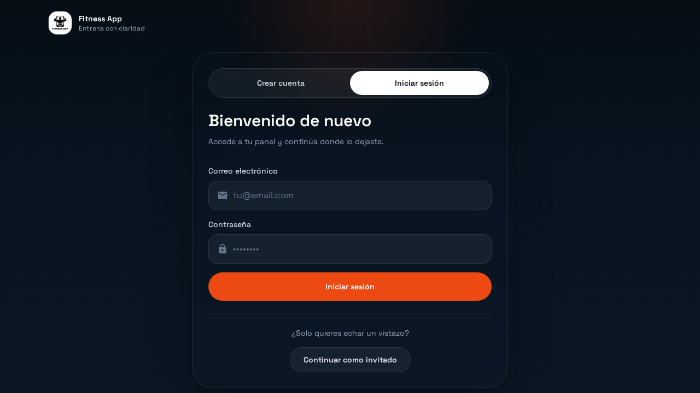
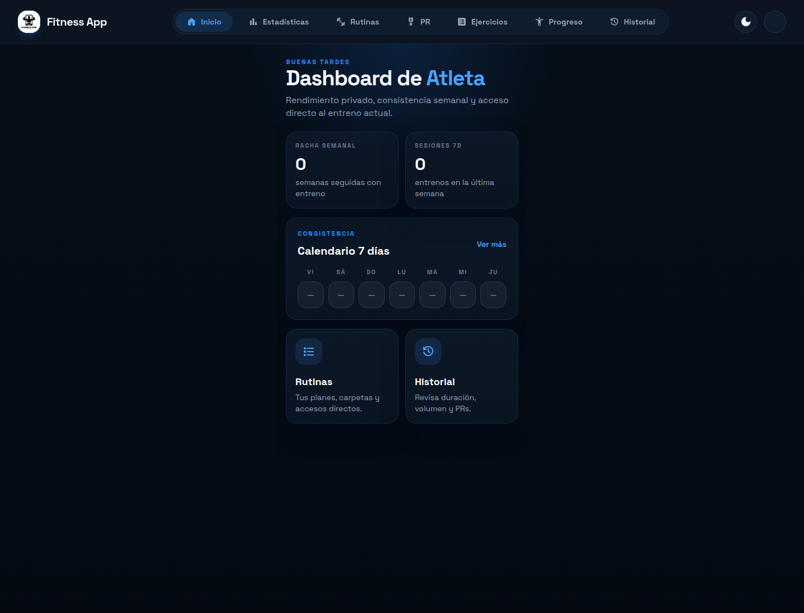

# Fitness App

Mobile-first workout tracker built with React, TypeScript, Zustand, and Supabase. The app focuses on fast session logging, compact progress analytics, and a cleaner phone-oriented training flow.

## Screenshots

### Landing



### Home



## What It Does

- Email auth with Supabase plus a guest flow for quick previews.
- Guided onboarding for profile basics, training goal, and context.
- Routine list and routine editor for saved training plans.
- Live workout sessions with active-workout resume support.
- Rest timer, workout timer, and plate calculator helpers.
- Exercise library and custom exercise editing.
- Dashboard with summary stats, workout calendar, volume chart, and muscle distribution.
- Workout history, PR tracking, and progress pages.

## Stack

- React 19
- Vite 6
- TypeScript
- Zustand
- Supabase
- Recharts
- React Router
- Cloudflare deployment via Wrangler

## Local Setup

### Prerequisites

- Node.js 20+
- npm
- Supabase project credentials

### Install

```bash
git clone git@github.com:HectorAlvarezPerez/fitness-app.git
cd fitness-app
npm install
```

### Environment

Create `.env` or `.env.local` in the project root:

```env
VITE_SUPABASE_URL=your_supabase_url
VITE_SUPABASE_ANON_KEY=your_supabase_anon_key
```

### Run

```bash
npm run dev
```

### Quality Checks

```bash
npm run test
npm run lint
npm run build
```

## Deployment

Production deploys are configured around Wrangler:

```bash
npm run deploy
```

That builds the Vite app and publishes it through the Cloudflare deployment flow configured in the repo.
