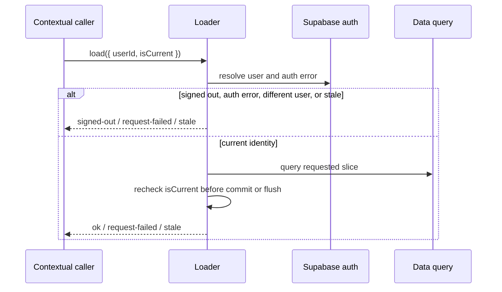

# Design: Robust Auth Bootstrap — Unit 1

## Technical Approach

`src/store/useStore.ts` exposes an optional contextual contract around the seven existing user-scoped loaders. A contextual caller supplies the expected user and a generation guard; each loader resolves auth, validates identity, checks staleness around the query, and returns an explicit result without allowing obsolete work to mutate state.

Calls without context preserve their prior page-owned behavior. This unit does not add an App coordinator, protected-route gate, lifecycle listeners, retry UI, or login navigation.

## Architecture Decisions

| Choice | Alternative | Rationale |
|---|---|---|
| Optional `LoadContext` | Replace every existing caller | Adds guarded orchestration primitives without changing legacy page flows. |
| Explicit `LoadResult` | Silent returns or thrown control flow | Lets a future coordinator distinguish success, signed-out, request failure, and stale work. |
| Auth and generation checks before query and commit | Check only once | Prevents obsolete requests from querying or committing after identity/generation changes. |
| Context-bound active-workout flush | Re-resolve an unbound user during flush | Prevents a captured workout from being written under another user or generation. |
| Preserve no-context semantics | Normalize all paths now | Keeps existing reconciliation and signed-out behavior outside this unit unchanged. |

## Sequence



## File Changes

| File | Action | Purpose |
|---|---|---|
| `src/store/useStore.ts` | Modify | Add contextual identity/result guards to seven loaders and bind active-workout flushes to the same context. |
| `src/store/useStore.bootstrap.test.ts` | Create | Cover contextual identity, auth/query failure, stale, empty/non-empty success, and legacy no-context behavior. |
| `src/store/useStore.sync.test.ts` | Modify | Cover active-workout reconciliation, failure retention, and stale/cross-user flush prevention. |

Actual implementation count: 1 created, 2 modified, 0 deleted.

## Interfaces / Contracts

```ts
type LoadContext = { userId: string; isCurrent: () => boolean };
type LoadResult =
  | { ok: true }
  | { ok: false; reason: 'signed-out' | 'request-failed' | 'stale' };
```

With context, every loader resolves auth and inspects the Supabase auth `.error`. No user returns `signed-out`; an auth error returns `request-failed`; a different resolved user or failed generation guard returns `stale`. These outcomes stop before data query, commit, or flush. After a query, `isCurrent()` must pass immediately before each `set` or active-workout flush. Query failures return `request-failed` without clearing the prior slice; empty successful reads commit the empty value and return `ok`.

The active-workout reconciliation path forwards the context into both flush branches. The flush revalidates session identity, generation, and captured persisted ownership before upsert.

Without context, signed-out behavior remains unchanged: ordinary loaders return without mutation, `loadUserData` clears `userData`, and `loadActiveWorkout` clears `activeWorkout` and `persistedUserId`. Existing local-newer, server-newer, no-row recreation, transient-error retention, and signed-out clearing behavior remains intact.

## Testing Strategy

Strict RED-GREEN-TRIANGULATE-REFACTOR used only `src/store/useStore.bootstrap.test.ts` and `src/store/useStore.sync.test.ts`.

| Requirement | Covered behavior |
|---|---|
| Contextual Loader Identity and Results | Current user, signed-out, mismatch, auth errors, and empty/non-empty success across seven loaders. |
| Contextual Failure and Stale Protection | Query failures retain state; pre-query and post-query obsolete work cannot mutate it. |
| Active-Workout Ownership and Legacy Compatibility | Existing reconciliation and signed-out outcomes plus cross-user and generation-stale flush rejection. |

Final focused evidence: 2 files, 22/22 tests passing. The exact-path lint and exact-file TypeScript checks passed; the full project type check retains unrelated baseline failures recorded in `apply-progress.md`.

## Threat Matrix

| Boundary | Applicability |
|---|---|
| Documentation-like paths | N/A — no classification or execution |
| Git repository selection | N/A — no VCS execution |
| Commit, push, or PR state | N/A — no publication automation |
| External runtime data | N/A — no runtime caller or data operation in this unit |

## Migration / Rollout

No migration, feature flag, database, service-worker, or runtime-coordinator change. Roll back the store and two focused test files together.

## Later Independent Changes

Protected-route gating and initial readiness belong in a later independent change. Auth/lifecycle event coalescing, recovery/retry UI, and immediate post-login navigation also belong in later independent changes.

## Open Questions

None for Unit 1.
